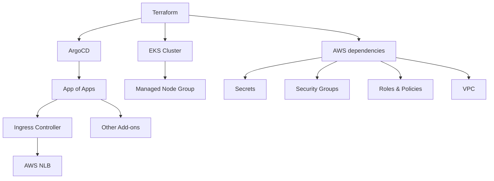

# GitOps Managed EKS Cluster
A Terraform module based on [Amazon EKS Blueprints for Terraform](https://aws-ia.github.io/terraform-aws-eks-blueprints/).

The following code will deploy a cluster with the following Argo Applications:
* Cluster Autoscaler
* External Dns
* Ingress Nginx
* Metrics Server

And the following AWS EKS Add-Ons:
* CoreDNS
* EBS CSI Driver
* KubeProxy
* VPC CNI

## Prerequisites
1. Have a hosted zone registered to you in Route53.
2. Have an asterisk certificate to its domain in Certificate Manager.

## Usage
1. Fill the missing info in `terraform/locals.tf`.
2. Fill the certificate ARN in `helm/add-ons/ingress-nginx/values.yaml`
3. Deploy with `terraform apply` in the `terraform` folder.
4. Login to ArgoCD at `argocd.${local.cluster_domain}` with the password in the newly created `argocd-${local.name}` secret.

## Flow Chart

## References
[Amazon EKS Blueprints for Terraform Documentation](https://aws-ia.github.io/terraform-aws-eks-blueprints/v4.12.2/add-ons/argocd/)